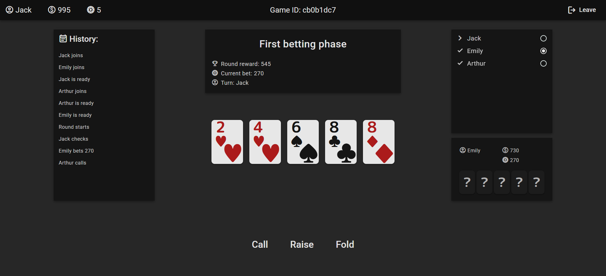
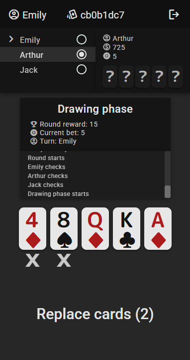

# Poker

## Overview
This repository contains the code for a server and web application that allows players to play poker online. The game follows a variant of the Five-Card Draw rules and supports multiplayer gameplay (2+ players). The primary focus is on providing a seamless experience for friends who want to play together with minimal setup. The process for starting a game is straightforward:

The game consists of the following phases:

1. **Not Started** - The game has not yet begun; players can mark or unmark themselves as ready.
2. **First Betting** - The first betting phase where players can bet, raise, fold, call, or check.
3. **Drawing** - Players can exchange any number of cards.
4. **Second Betting** - The final betting phase, with the same actions as the first round.
5. **Showdown** - The round ends, and the player with the strongest hand wins. All hands are revealed, and players can mark themselves as ready for the next round.
6. **Finished** - The game concludes when one player has collected all the chips.

## Screenshots

### Game panel (desktop)


### Game panel (mobile)


## Architecture

Poker is a full-stack application composed of three main components:

- **Server** (Spring Framework)
- **Web App** (Angular, served by Nginx)
- **Database** (Redis)

### Server

The backend is built with Java using the Spring Framework. Spring Reactive Web was used as the Web Dependecy, which utilizes **Spring WebFlux** and **Netty**.

The server handles the game logic and maintains the correct game state. The two key responsibilities are handling player actions and asynchronously broadcasting game state updates.

#### Handling actions

The process of handling a player's action follows these steps:

1. Receiving an HTTP REST request with the action (e.g., raising the bet).
2. Checking if the game with the specified ID exists.
3. Retrieving and reconstructing the game state.
4. Validating whether the action is legal based on the current game state.
5. Sending the action to the event stream in the redis database.

#### Broadcasting game state

To ensure that all players receive real-time updates, the application uses **Server-Sent Events (SSE)**. The API provides an endpoint:
```
GET /game/{gameId}/subscribe
```
which returns a **text/event-stream** response containing live game updates.

#### State Reconstruction

Both action handling and game state broadcasting require reconstructing the current game state. This is achieved using the **Event Sourcing** pattern.

The game state consists of:
1. **Initial game state** - game ID and seed.
2. **Event stream** - a chronological sequence of all actions performed during the game.

By applying all actions in order to the initial state, the current game state can be derived.

#### API Documentation

API documentation is available via **Swagger** at:
```
/swagger-ui.html
```

#### Testing

The server is tested using unit, integration, and end-to-end tests with the following technologies:

- **JUnit 5**
- **AssertJ**
- **Mockito**
- **Testcontainers**
- **Spring Boot Test**

### Web App

The web application is built using **TypeScript** with the **Angular** framework. Its main responsibilities are:

- Displaying the current game state.
- Sending player actions to the server.
- Allowing users to create or join a game effortlessly.

The UI is developed with **Angular Material** and supports **responsive design** with separate layouts for desktop and mobile.

The application is available **only in English** and is served to users via **Nginx**.


## Installation & Deployment

### Prerequisites
- **Java 21+**
- **Node.js 18.19+**
- **Docker**

### 1. Clone the Repository
```sh
git clone https://github.com/olszewski-mateusz/poker-online.git
```

### 2. Build Docker Images

#### Server
```sh
cd server
./mvnw package
cd ..
```

#### Web App
```sh
cd app
npm run build-image
cd ..
```

### 3. Start the project with Docker Compose
```sh
cd docker
docker compose up -d
```

## License
This project is licensed under the MIT License.

